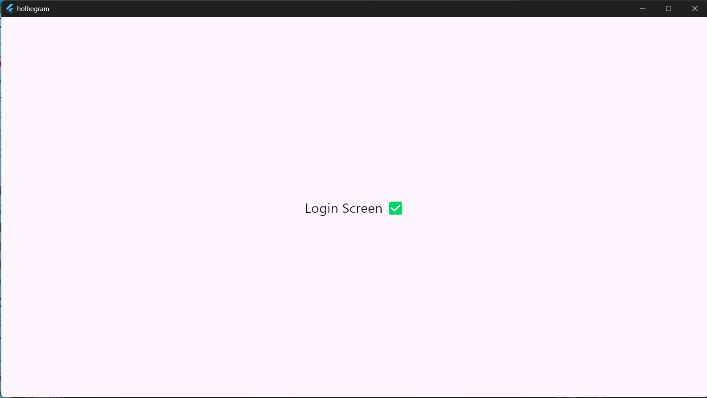
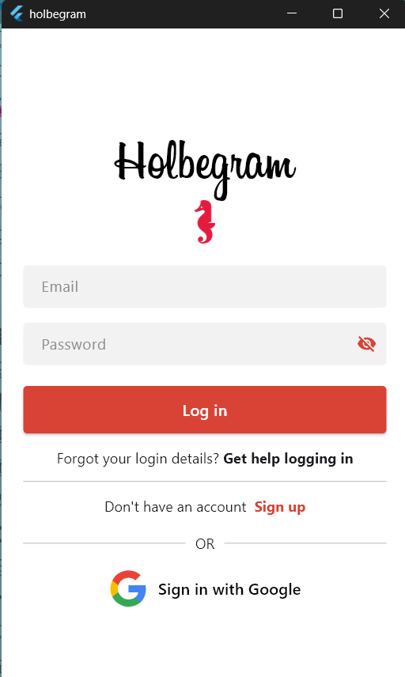
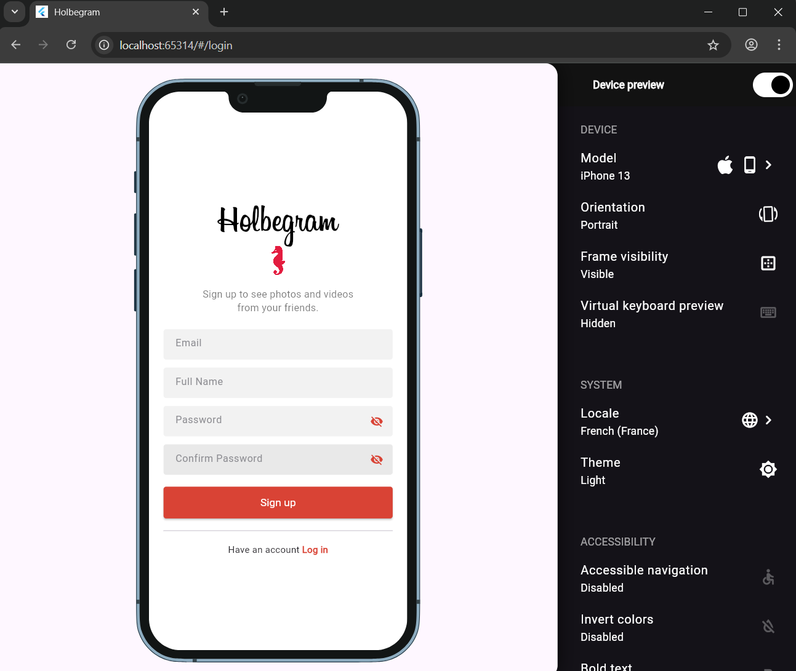
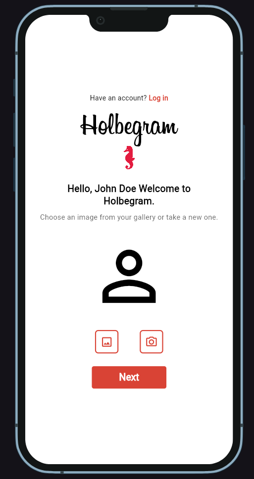

# holbertonschool-holbegram

flutter pub add firebase_core
flutter pub add firebase_auth
flutter pub add firebase_database
flutter pub add cloudinary_flutter


powershell
Windows PowerShell
Copyright (C) Microsoft Corporation. Tous droits réservés.

Installez la dernière version de PowerShell pour de nouvelles fonctionnalités et améliorations ! https://aka.ms/PSWindows

PS C:\Users\steph> flutter --version
Building flutter tool...
Running pub upgrade...
Resolving dependencies... (1.1s)
Downloading packages... (4.9s)
Got dependencies.
Flutter 3.38.5 • channel stable • https://github.com/flutter/flutter.git
Framework • revision f6ff1529fd (4 days ago) • 2025-12-11 11:50:07 -0500
Engine • hash c108a94d7a8273e112339e6c6833daa06e723a54 (revision 1527ae0ec5) (4 days ago) • 2025-12-11 15:04:31.000Z
Tools • Dart 3.10.4 • DevTools 2.51.1
PS C:\Users\steph> flutter doctor
Doctor summary (to see all details, run flutter doctor -v):
[√] Flutter (Channel stable, 3.38.5, on Microsoft Windows [version 10.0.26200.7462], locale fr-FR)
[√] Windows Version (11 Famille 64-bit, 25H2, 2009)
[!] Android toolchain - develop for Android devices (Android SDK version 34.0.0)
    X cmdline-tools component is missing.
      Try installing or updating Android Studio.
      Alternatively, download the tools from https://developer.android.com/studio#command-line-tools-only and make sure
      to set the ANDROID_HOME environment variable.
      See https://developer.android.com/studio/command-line for more details.
    X Android license status unknown.
      Run `flutter doctor --android-licenses` to accept the SDK licenses.
      See https://flutter.dev/to/windows-android-setup for more details.
[√] Chrome - develop for the web
[!] Visual Studio - develop Windows apps (Visual Studio Build Tools 2022 17.14.8)
    X Visual Studio is missing necessary components. Please re-run the Visual Studio installer for the "Desktop
      development with C++" workload, and include these components:
        MSVC v142 - VS 2019 C++ x64/x86 build tools
         - If there are multiple build tool versions available, install the latest
        C++ CMake tools for Windows
        Windows 10 SDK
[√] Connected device (3 available)
[√] Network resources

! Doctor found issues in 2 categories.
PS C:\Users\steph>

flutter doctor --android-licenses


PS C:\Users\steph> flutter doctor
Doctor summary (to see all details, run flutter doctor -v):
[√] Flutter (Channel stable, 3.38.5, on Microsoft Windows [version 10.0.26200.7462], locale fr-FR)
[√] Windows Version (11 Famille 64-bit, 25H2, 2009)
[!] Android toolchain - develop for Android devices (Android SDK version 34.0.0)
    X Flutter requires Android SDK 36 and the Android BuildTools 28.0.3
      To update the Android SDK visit https://flutter.dev/to/windows-android-setup for detailed instructions.
[√] Chrome - develop for the web
[!] Visual Studio - develop Windows apps (Visual Studio Build Tools 2022 17.14.8)
    X Visual Studio is missing necessary components. Please re-run the Visual Studio installer for the "Desktop
      development with C++" workload, and include these components:
        MSVC v142 - VS 2019 C++ x64/x86 build tools
         - If there are multiple build tool versions available, install the latest
        C++ CMake tools for Windows
        Windows 10 SDK
[√] Connected device (3 available)
[√] Network resources

! Doctor found issues in 2 categories.
PS C:\Users\steph>


PS D:\Users\steph\Documents\6ème trimestre\holbertonschool-holbegram> flutter run
No supported devices connected.

The following devices were found, but are not supported by this project:
Windows (desktop) • windows • windows-x64    • Microsoft Windows [version 10.0.26200.7462]
Chrome (web)      • chrome  • web-javascript • Google Chrome 143.0.7499.41
Edge (web)        • edge    • web-javascript • Microsoft Edge 143.0.3650.80
If you would like your app to run on web or windows, consider running `flutter create .` to generate projects for these
platforms.
PS D:\Users\steph\Documents\6ème trimestre\holbertonschool-holbegram> flutter clean
PS D:\Users\steph\Documents\6ème trimestre\holbertonschool-holbegram> flutter pub get
Resolving dependencies... (1.1s)
Downloading packages... (4.6s)
+ _flutterfire_internals 1.3.59 (1.3.65 available)
+ async 2.13.0
+ boolean_selector 2.1.2
+ cached_network_image 3.4.1
+ cached_network_image_platform_interface 4.1.1
+ cached_network_image_web 1.3.1
+ characters 1.4.0 (1.4.1 available)
+ clock 1.1.2
+ cloudinary_flutter 1.3.0
+ cloudinary_url_gen 1.8.0
+ collection 1.19.1
+ convert 3.1.2
+ crypto 3.0.7
+ csslib 1.0.2
+ cupertino_icons 1.0.8
+ fake_async 1.3.3
+ ffi 2.1.4
+ file 7.0.1
+ firebase_auth 5.7.0 (6.1.3 available)
+ firebase_auth_platform_interface 7.7.3 (8.1.5 available)
+ firebase_auth_web 5.15.3 (6.1.1 available)
+ firebase_core 3.15.2 (4.3.0 available)
+ firebase_core_platform_interface 6.0.2
+ firebase_core_web 2.24.1 (3.3.1 available)
+ firebase_database 11.3.10 (12.1.1 available)
+ firebase_database_platform_interface 0.2.6+10 (0.3.0+1 available)
+ firebase_database_web 0.2.6+16 (0.2.7+2 available)
+ fixnum 1.1.1
+ flutter 0.0.0 from sdk flutter
+ flutter_cache_manager 3.4.1
+ flutter_lints 5.0.0 (6.0.0 available)
+ flutter_test 0.0.0 from sdk flutter
+ flutter_web_plugins 0.0.0 from sdk flutter
+ html 0.15.6
+ http 1.6.0
+ http_parser 4.1.2
+ leak_tracker 11.0.2
+ leak_tracker_flutter_testing 3.0.10
+ leak_tracker_testing 3.0.2
+ lints 5.1.1 (6.0.0 available)
+ matcher 0.12.17 (0.12.18 available)
+ material_color_utilities 0.11.1 (0.13.0 available)
+ meta 1.17.0
+ octo_image 2.1.0
+ path 1.9.1
+ path_provider 2.1.5
+ path_provider_android 2.2.22
+ path_provider_foundation 2.5.1
+ path_provider_linux 2.2.1
+ path_provider_platform_interface 2.1.2
+ path_provider_windows 2.3.0
+ platform 3.1.6
+ plugin_platform_interface 2.1.8
+ rxdart 0.28.0
+ shared_preferences 2.5.4
+ shared_preferences_android 2.4.18
+ shared_preferences_foundation 2.5.6
+ shared_preferences_linux 2.4.1
+ shared_preferences_platform_interface 2.4.1
+ shared_preferences_web 2.4.3
+ shared_preferences_windows 2.4.1
+ sky_engine 0.0.0 from sdk flutter
+ source_span 1.10.1
+ sqflite 2.4.2
+ sqflite_android 2.4.2+2
+ sqflite_common 2.5.6
+ sqflite_darwin 2.4.2
+ sqflite_platform_interface 2.4.0
+ stack_trace 1.12.1
+ stream_channel 2.1.4
+ string_scanner 1.4.1
+ synchronized 3.4.0
+ term_glyph 1.2.2
+ test_api 0.7.7 (0.7.8 available)
+ typed_data 1.4.0
+ universal_io 2.3.1
+ uuid 4.5.2
+ vector_math 2.2.0
+ video_player 2.10.1
+ video_player_android 2.8.22
+ video_player_avfoundation 2.8.8
+ video_player_platform_interface 6.6.0
+ video_player_web 2.4.0
+ vm_service 15.0.2
+ web 1.1.1
+ xdg_directories 1.1.0
Changed 86 dependencies!
15 packages have newer versions incompatible with dependency constraints.
Try `flutter pub outdated` for more information.
PS D:\Users\steph\Documents\6ème trimestre\holbertonschool-holbegram> flutter run
No supported devices connected.

The following devices were found, but are not supported by this project:
Windows (desktop) • windows • windows-x64    • Microsoft Windows [version 10.0.26200.7462]
Chrome (web)      • chrome  • web-javascript • Google Chrome 143.0.7499.41
Edge (web)        • edge    • web-javascript • Microsoft Edge 143.0.3650.80
If you would like your app to run on web or windows, consider running `flutter create .` to generate projects for these
platforms.
PS D:\Users\steph\Documents\6ème trimestre\holbertonschool-holbegram>


PS D:\Users\steph\Documents\6ème trimestre\holbertonschool-holbegram> flutter run
Connected devices:
Windows (desktop) • windows • windows-x64    • Microsoft Windows [version 10.0.26200.7462]
Chrome (web)      • chrome  • web-javascript • Google Chrome 143.0.7499.41
Edge (web)        • edge    • web-javascript • Microsoft Edge 143.0.3650.80
[1]: Windows (windows)
[2]: Chrome (chrome)
[3]: Edge (edge)
Please choose one (or "q" to quit): 2
Launching lib\main.dart on Chrome in debug mode...
Waiting for connection from debug service on Chrome...             18,2s

Flutter run key commands.
r Hot reload.
R Hot restart.
h List all available interactive commands.
d Detach (terminate "flutter run" but leave application running).
c Clear the screen
q Quit (terminate the application on the device).

This app is linked to the debug service: ws://127.0.0.1:59430/ad97z9oeAd0=/ws
Debug service listening on ws://127.0.0.1:59430/ad97z9oeAd0=/ws
A Dart VM Service on Chrome is available at: http://127.0.0.1:59430/ad97z9oeAd0=
The Flutter DevTools debugger and profiler on Chrome is available at:
http://127.0.0.1:59430/ad97z9oeAd0=/devtools/?uri=ws://127.0.0.1:59430/ad97z9oeAd0=/ws
Starting application from main method in: org-dartlang-app:/web_entrypoint.dart.
Application finished.
Terminer le programme de commandes (O/N) ? o
PS D:\Users\steph\Documents\6ème trimestre\holbertonschool-holbegram> flutter run
Connected devices:
Windows (desktop) • windows • windows-x64    • Microsoft Windows [version 10.0.26200.7462]
Chrome (web)      • chrome  • web-javascript • Google Chrome 143.0.7499.41
Edge (web)        • edge    • web-javascript • Microsoft Edge 143.0.3650.80
[1]: Windows (windows)
[2]: Chrome (chrome)
[3]: Edge (edge)
Please choose one (or "q" to quit): 2
Launching lib\main.dart on Chrome in debug mode...
Waiting for connection from debug service on Chrome...             14,7s

Flutter run key commands.
r Hot reload.
R Hot restart.
h List all available interactive commands.
d Detach (terminate "flutter run" but leave application running).
c Clear the screen
q Quit (terminate the application on the device).

This app is linked to the debug service: ws://127.0.0.1:53043/EP2aaKEcZIE=/ws
Debug service listening on ws://127.0.0.1:53043/EP2aaKEcZIE=/ws
A Dart VM Service on Chrome is available at: http://127.0.0.1:53043/EP2aaKEcZIE=
The Flutter DevTools debugger and profiler on Chrome is available at:
http://127.0.0.1:53043/EP2aaKEcZIE=/devtools/?uri=ws://127.0.0.1:53043/EP2aaKEcZIE=/ws
Starting application from main method in: org-dartlang-app:/web_entrypoint.dart.





```bash
flutter run -d chrome
flutter run -d windows

flutter build windows
flutter build web
```

PS D:\Users\steph\Documents\dev\holbertonschool-holbegram> flutter run -d chrome
Launching lib\main.dart on Chrome in debug mode...
Waiting for connection from debug service on Chrome...             29,2s

Flutter run key commands.
r Hot reload.
R Hot restart.
h List all available interactive commands.
d Detach (terminate "flutter run" but leave application running).
c Clear the screen
q Quit (terminate the application on the device).

This app is linked to the debug service: ws://127.0.0.1:52841/o7qsBd5OVoo=/ws
Debug service listening on ws://127.0.0.1:52841/o7qsBd5OVoo=/ws
A Dart VM Service on Chrome is available at: http://127.0.0.1:52841/o7qsBd5OVoo=
The Flutter DevTools debugger and profiler on Chrome is available at:
http://127.0.0.1:52841/o7qsBd5OVoo=/devtools/?uri=ws://127.0.0.1:52841/o7qsBd5OVoo=/ws
Starting application from main method in: org-dartlang-app:/web_entrypoint.dart.
Application finished.
Terminer le programme de commandes (O/N) ? o
PS D:\Users\steph\Documents\dev\holbertonschool-holbegram> flutter run -d windows
Launching lib\main.dart on Windows in debug mode...
CMake Deprecation Warning at D:/Users/steph/Documents/dev/holbertonschool-holbegram/build/windows/x64/extracted/firebase_cpp_sdk_windows/CMakeLists.txt:17 (cmake_minimum_required):
  Compatibility with CMake < 3.10 will be removed from a future version of
  CMake.

  Update the VERSION argument <min> value.  Or, use the <min>...<max> syntax
  to tell CMake that the project requires at least <min> but has been updated
  to work with policies introduced by <max> or earlier.


Building Windows application...                                    12,7s
√ Built build\windows\x64\runner\Debug\holbegram.exe
Syncing files to device Windows...                                 106ms

Flutter run key commands.
r Hot reload.
R Hot restart.
h List all available interactive commands.
d Detach (terminate "flutter run" but leave application running).
c Clear the screen
q Quit (terminate the application on the device).

A Dart VM Service on Windows is available at: http://127.0.0.1:50308/U6NRiKJkmGQ=/
The Flutter DevTools debugger and profiler on Windows is available at:
http://127.0.0.1:50308/U6NRiKJkmGQ=/devtools/?uri=ws://127.0.0.1:50308/U6NRiKJkmGQ=/ws


PS D:\Users\steph\Documents\dev\holbertonschool-holbegram> flutter pub add firebase_core
"firebase_core" is already in "dependencies". Will try to update the constraint.
Resolving dependencies...
Downloading packages...
  _flutterfire_internals 1.3.59 (1.3.65 available)
  characters 1.4.0 (1.4.1 available)
  firebase_auth 5.7.0 (6.1.3 available)
  firebase_auth_platform_interface 7.7.3 (8.1.5 available)
  firebase_auth_web 5.15.3 (6.1.1 available)
  firebase_core 3.15.2 (4.3.0 available)
  firebase_core_web 2.24.1 (3.3.1 available)
  firebase_database 11.3.10 (12.1.1 available)
  firebase_database_platform_interface 0.2.6+10 (0.3.0+1 available)
  firebase_database_web 0.2.6+16 (0.2.7+2 available)
  flutter_lints 5.0.0 (6.0.0 available)
  lints 5.1.1 (6.0.0 available)
  matcher 0.12.17 (0.12.18 available)
  material_color_utilities 0.11.1 (0.13.0 available)
  test_api 0.7.7 (0.7.8 available)
Got dependencies!
15 packages have newer versions incompatible with dependency constraints.
Try `flutter pub outdated` for more information.
PS D:\Users\steph\Documents\dev\holbertonschool-holbegram>

PS D:\Users\steph\Documents\dev\holbertonschool-holbegram> flutter pub add firebase_core
"firebase_core" is already in "dependencies". Will try to update the constraint.
Resolving dependencies...
Downloading packages...
  _flutterfire_internals 1.3.59 (1.3.65 available)
  characters 1.4.0 (1.4.1 available)
  firebase_auth 5.7.0 (6.1.3 available)
  firebase_auth_platform_interface 7.7.3 (8.1.5 available)
  firebase_auth_web 5.15.3 (6.1.1 available)
  firebase_core 3.15.2 (4.3.0 available)
  firebase_core_web 2.24.1 (3.3.1 available)
  firebase_database 11.3.10 (12.1.1 available)
  firebase_database_platform_interface 0.2.6+10 (0.3.0+1 available)
  firebase_database_web 0.2.6+16 (0.2.7+2 available)
  flutter_lints 5.0.0 (6.0.0 available)
  lints 5.1.1 (6.0.0 available)
  matcher 0.12.17 (0.12.18 available)
  material_color_utilities 0.11.1 (0.13.0 available)
  test_api 0.7.7 (0.7.8 available)
Got dependencies!
15 packages have newer versions incompatible with dependency constraints.
Try `flutter pub outdated` for more information.
PS D:\Users\steph\Documents\dev\holbertonschool-holbegram> flutter pub get
Resolving dependencies... (1.2s)
Downloading packages...
  _flutterfire_internals 1.3.59 (1.3.65 available)
  characters 1.4.0 (1.4.1 available)
  firebase_auth 5.7.0 (6.1.3 available)
  firebase_auth_platform_interface 7.7.3 (8.1.5 available)
  firebase_auth_web 5.15.3 (6.1.1 available)
  firebase_core 3.15.2 (4.3.0 available)
  firebase_core_web 2.24.1 (3.3.1 available)
  firebase_database 11.3.10 (12.1.1 available)
  firebase_database_platform_interface 0.2.6+10 (0.3.0+1 available)
  firebase_database_web 0.2.6+16 (0.2.7+2 available)
  flutter_lints 5.0.0 (6.0.0 available)
  lints 5.1.1 (6.0.0 available)
  matcher 0.12.17 (0.12.18 available)
  material_color_utilities 0.11.1 (0.13.0 available)
  test_api 0.7.7 (0.7.8 available)
Got dependencies!
15 packages have newer versions incompatible with dependency constraints.
Try `flutter pub outdated` for more information.
PS D:\Users\steph\Documents\dev\holbertonschool-holbegram>


PS D:\Users\steph\Documents\dev\holbertonschool-holbegram\holbegram> flutter pub add flutter_svg
Resolving dependencies...
Downloading packages...
  _flutterfire_internals 1.3.59 (1.3.65 available)
+ args 2.7.0
  characters 1.4.0 (1.4.1 available)
  firebase_auth 5.7.0 (6.1.3 available)
  firebase_auth_platform_interface 7.7.3 (8.1.5 available)
  firebase_auth_web 5.15.3 (6.1.1 available)
  firebase_core 3.15.2 (4.3.0 available)
  firebase_core_web 2.24.1 (3.3.1 available)
  firebase_database 11.3.10 (12.1.1 available)
  firebase_database_platform_interface 0.2.6+10 (0.3.0+1 available)
  firebase_database_web 0.2.6+16 (0.2.7+2 available)
  flutter_lints 5.0.0 (6.0.0 available)
+ flutter_svg 2.2.3
  lints 5.1.1 (6.0.0 available)
  matcher 0.12.17 (0.12.18 available)
  material_color_utilities 0.11.1 (0.13.0 available)
+ path_parsing 1.1.0
+ petitparser 7.0.1
  test_api 0.7.7 (0.7.8 available)
+ vector_graphics 1.1.19
+ vector_graphics_codec 1.1.13
+ vector_graphics_compiler 1.1.19
+ xml 6.6.1
Changed 8 dependencies!
15 packages have newer versions incompatible with dependency constraints.
Try `flutter pub outdated` for more information.
PS D:\Users\steph\Documents\dev\holbertonschool-holbegram\holbegram>


flutter clean
flutter pub get
flutter run



flutter pub add device_preview

PS D:\Users\steph\Documents\dev\holbertonschool-holbegram\holbegram> flutter pub add device_preview
Resolving dependencies...
Downloading packages...
  _flutterfire_internals 1.3.59 (1.3.65 available)
  characters 1.4.0 (1.4.1 available)
+ device_frame 1.4.0
+ device_preview 1.3.1
  firebase_auth 5.7.0 (6.1.3 available)
  firebase_auth_platform_interface 7.7.3 (8.1.5 available)
  firebase_auth_web 5.15.3 (6.1.1 available)
  firebase_core 3.15.2 (4.3.0 available)
  firebase_core_web 2.24.1 (3.3.1 available)
  firebase_database 11.3.10 (12.1.1 available)
  firebase_database_platform_interface 0.2.6+10 (0.3.0+1 available)
  firebase_database_web 0.2.6+16 (0.2.7+2 available)
  flutter_lints 5.0.0 (6.0.0 available)
+ flutter_localizations 0.0.0 from sdk flutter
+ freezed_annotation 3.1.0
+ intl 0.20.2
+ json_annotation 4.9.0
  lints 5.1.1 (6.0.0 available)
  matcher 0.12.17 (0.12.18 available)
  material_color_utilities 0.11.1 (0.13.0 available)
+ nested 1.0.0
+ provider 6.1.5+1
  test_api 0.7.7 (0.7.8 available)
Changed 8 dependencies!
15 packages have newer versions incompatible with dependency constraints.
Try `flutter pub outdated` for more information.
PS D:\Users\steph\Documents\dev\holbertonschool-holbegram\holbegram>






